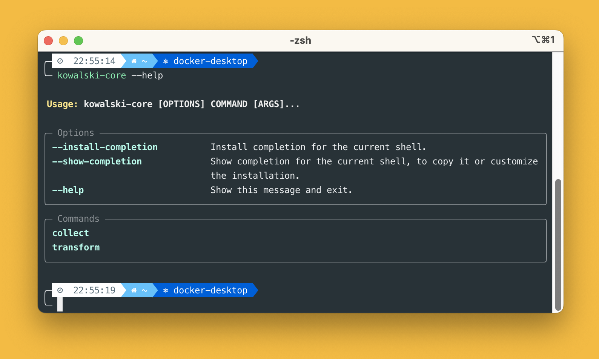
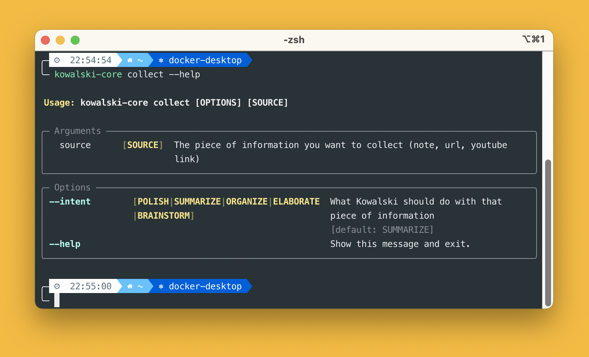
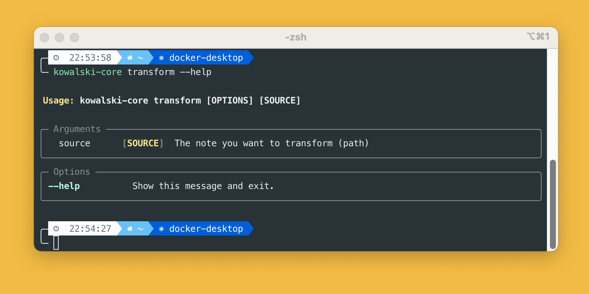

<p align="center">
  
</p>

# kowalski-core

[](https://pypi.org/project/kowalski-core)
[](https://pypi.org/project/kowalski-core)

kowalski-core is a simple cli for note taking, built with [Typer](https://github.com/fastapi/typer).

kowalski-core can capture strings, urls and youtube transcriptions, create `*.md` notes and easily process them with your LLM of choice via [Groq](https://groq.com/)

-----

## Table of Contents

- [kowalski-core](#kowalski-core)
  - [Table of Contents](#table-of-contents)
  - [Screenshots](#screenshots)
  - [Usage](#usage)
    - [Collect](#collect)
    - [Transform](#transform)
    - [Bonus](#bonus)
  - [Rationale](#rationale)
  - [Setup](#setup)
  - [License](#license)

## Screenshots

<table>
<tr><td></td><td></td></tr>
<tr><td></td><td></td></tr>
</table>

## Usage



Two commands are available:
- collect
- transform

### Collect



This is how you collect basic notes. Source can be:
- a string, if you want to jot down a quick idea
- a youtube link, if you want to get its transcription
- a generic url, if you want to get its content

Kowalski will create a markdown note whose content depends on the source above.

When calling the collect command you can specify an *intent*. At the moment 5 intents are available:
- SUMMARIZE
- POLISH
- ORGANIZE
- ELABORATE
- BRAINSTORM

The chosen intent will determine how Kowalski will process the note when invoking the transform command.

### Transform



This is how you process notes coming from the collect command. Source is always the path of the note you want to transform. Kowalski will process that note according to the intent defined in the previous step.

### Bonus

The two commands can be piped, ie you can do:
```
kowalski collect [OPTIONS] [SOURCE] | kowalski transform
```

In this way the transformation will be applied straight to the note collected. You can also pipe in the output from pbpaste for maximum efficiency:
```
pbpaste | kowalski collect [OPTIONS] [SOURCE] | kowalski transform
```
And define a shortcut in your terminal for ease


## Rationale

At work I:
- consume a lot of webpages (mostly Sagemaker documentation xD)
- occasionally watch youtube tutorials
- write quick and bad notes
- code

All in all I end up reading and writing a lot of text.

According to [The New York Times](https://archive.nytimes.com/bits.blogs.nytimes.com/2009/12/09/the-american-diet-34-gigabytes-a-day/) we process 34 gigabytes of information every day. This is the equivalent of 100000 words or 174 newspapers. But a big chunk of this information goes wasted, unless you have a really good memory.

Partly inspired by what Daniel Miessler did with [Fabric](https://github.com/danielmiessler/fabric), I ended up developing `kowalski`, in its cli version for now. `kowalski` is my way of easily building a knowledge base with the help of LLMs. I can now paste any youtube link in the terminal and `kowalski` will handle it for me, retrieving its transcription and then summarize it for me. Or I can jot down a quick idea and `kowalski` will elaborate on it for me.

## Setup

Clone the repo, `cd` into `kowalski_core`, create a `config.py` file under the `kowalski_core` subfolder. The content of `config.py` should be:
```
NOTES_PATH=<YOUR_NOTES_PATH_HERE>
GROQ_API_KEY=<YOUR_API_KEY_HERE>
MODEL_NAME=<YOUR_MODEL_NAME_HERE>
```
where:
- `NOTES_PATH` can be any path, but make sure to have two subfolders in there, one called `collect` and one called `transform`.
- `GROQ_API_KEY` is the api key from the Groq dashboard.
- `MODEL_NAME` is the Model ID of your model of choice from [here](https://console.groq.com/docs/models).

A sample config would be:
```
NOTES_PATH='/Users/maf/Documents/notes'
GROQ_API_KEY=<MY_API_KEY_HERE>
MODEL_NAME='llama3-8b-8192'
```
Then `cd ..` and then run `pipx install .`

## License

`kowalski-core` is distributed under the terms of the [GNU general public license](https://www.gnu.org/licenses/gpl-3.0.html).
