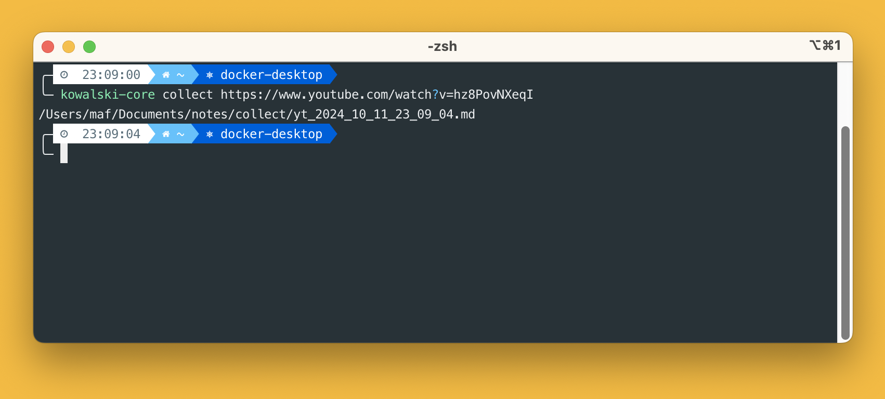
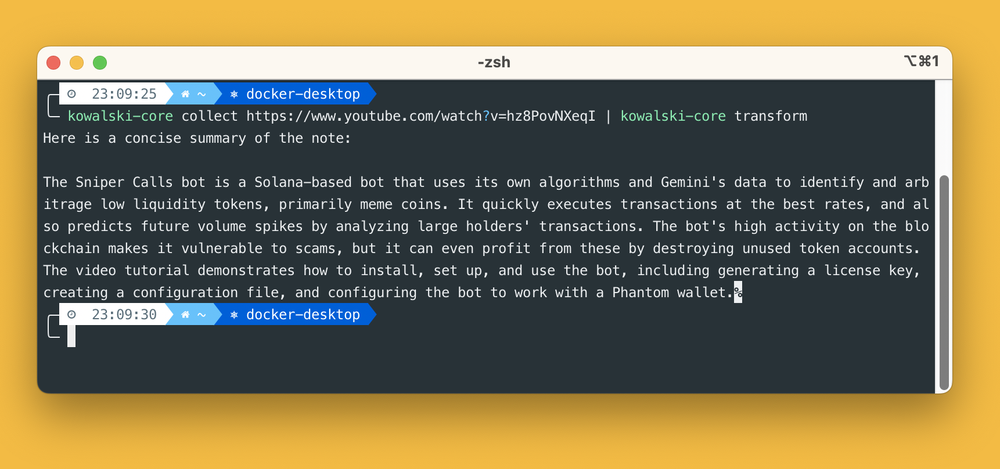
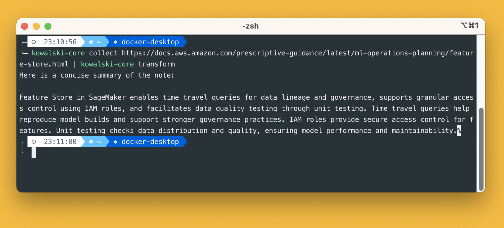
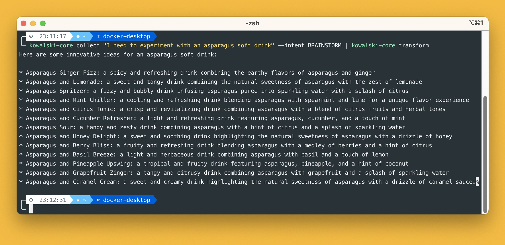

<p align="center">
  
</p>

# kowalski-core

[](https://pypi.org/project/kowalski-core)
[](https://pypi.org/project/kowalski-core)

kowalski-core is a simple cli for note taking, built with [Typer](https://github.com/fastapi/typer).

kowalski-core can capture strings, urls and youtube transcriptions, create `*.md` notes and easily process them with your LLM of choice via [Groq](https://groq.com/)

-----

## Table of Contents

- [kowalski-core](#kowalski-core)
  - [Table of Contents](#table-of-contents)
  - [Screenshots](#screenshots)
  - [Usage](#usage)
  - [Rationale](#rationale)
  - [Setup](#setup)
  - [License](#license)

## Screenshots

<table>
<tr><td></td><td></td></tr>
<tr><td></td><td></td></tr>
</table>

## Usage


## Rationale

At work I:
- consume a lot of webpages (mostly Sagemaker documentation xD)
- occasionally watch youtube tutorials
- write quick and bad notes
- code

All in all I end up reading and writing a lot of text.

According to [The New York Times](https://archive.nytimes.com/bits.blogs.nytimes.com/2009/12/09/the-american-diet-34-gigabytes-a-day/) we process 34 gigabytes of information every day. This is the equivalent of 100000 words or 174 newspapers. But a big chunk of this information goes wasted, unless you have a really good memory.

Partly inspired by what Daniel Miessler did with [Fabric](https://github.com/danielmiessler/fabric), I ended up developing `kowalski`, in its cli version for now. `kowalski` is my way of easily building a knowledge base with the help of LLMs. I can now paste any youtube link in the terminal and `kowalski` will handle it for me, retrieving its transcription and then summarize it for me. Or I can jot down a quick idea and `kowalski` will elaborate on it for me.

## Setup

Clone the repo, `cd` into `kowalski_core`, create a `config.py` file under the `kowalski_core` subfolder. The content of `kowalski.conf` should be:
```
[GENERAL]
NOTES_PATH=<YOUR_NOTES_PATH_HERE>
TEMPLATES_PATH=kowalski_core/templates
[MODEL]
GROQ_API_KEY=<YOUR_GROQ_API_KEY_HERE>
MODEL_NAME=<YOUR_MODEL_CHOICE_HERE>
```
where:
- `NOTES_PATH` can be any path, but make sure to have two subfolders in there, one called `collect` and one called `transform`.
- `TEMPLATES_PATH` is the path where the llm templated prompts are saved. Stick to the default path in the example, unless you feel frisky and want to provide your own prompts.
- `GROQ_API_KEY` is the api key from the Groq dashboard.
- `MODEL_NAME` is the Model ID of your model of choice from [here](https://console.groq.com/docs/models).

A sample config would be:
```
[GENERAL]
NOTES_PATH=C:/Users/Matteo/Documents/GitHub/notes
TEMPLATES_PATH=kowalski_core/templates
[MODEL]
GROQ_API_KEY=https://www.youtube.com/watch?v=dQw4w9WgXcQ&pp=ygUXbmV2ZXIgZ29ubmEgZ2l2ZSB5b3UgdXA%3D
MODEL_NAME=llama3-8b-8192
```
Then `cd ..` and then run `pipx install .`

## License

`kowalski` is distributed under the terms of the [GNU general public license](https://www.gnu.org/licenses/gpl-3.0.html).
